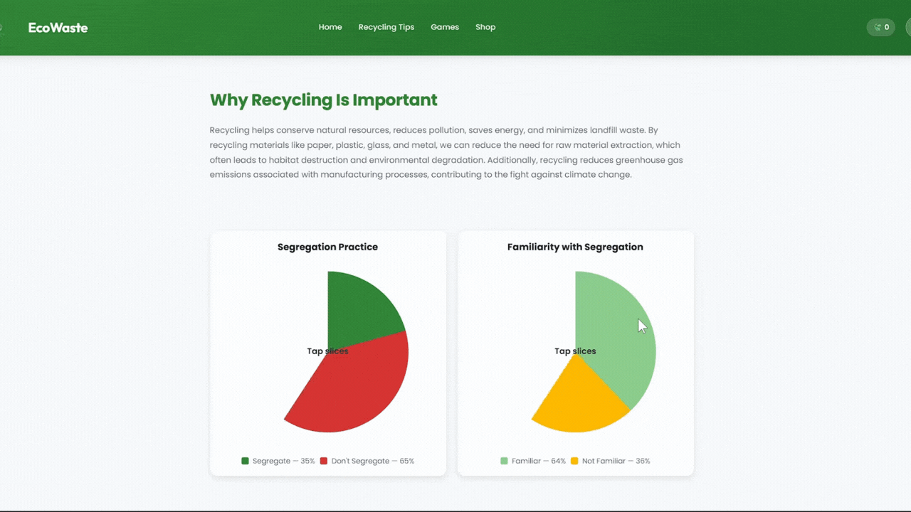
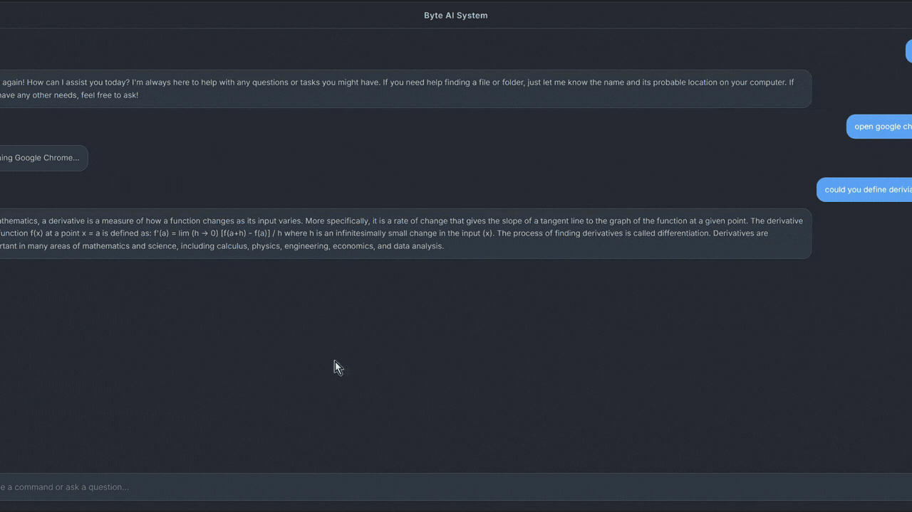

# 📡 I'm Tanay (Ren) 
### 14-year-old CS Major | Full-Stack Architect | Automation Enthusiast

> "If a task takes more than two minutes and has to be done twice, it’s getting a script." 

  

---

### 📂 User Profile: /dev/tanay
I’m a 14-year-old Computer Science major who traded a normal sleep schedule for the ability to build full-stack applications. My philosophy is simple: **Calm Logic + Witty Mind.** I believe software should be efficient, scalable, and—most importantly—automated. When I'm not debugging, I'm likely refining my Linux setup or exploring the boundaries of system architecture.

* **Current Focus:** Mastering the art of scalable backend systems.
* **Superpower:** Finding the one missing semicolon in 500 lines of code.
* **Philosophy:** Clean code is a love letter to your future self.
* **Non-Technical Subprocesses:**
    * 🍳 **Cooking:** Applying the same precision to recipes as I do to algorithms.
    * 🎮 **Gaming:** Currently maintaining a high win-rate in virtual worlds.
    * 🏸 **Badminton:** Keeping my real-world FPS (Frames Per Smash) high.

---

### 🛠 Tech Arsenal (Verified Technologies)

| Category | Tools of Choice |
| :--- | :--- |
| **Languages** |    |
| **Frontend** |    |
| **Backend/Cloud** |    |
| **Tools** |   |

---

### 📂 Directory: `/home/ren/featured_work`

  
  
  

  <b><a href="https://github.com/Byte-ne/EduWay">🎓 EduWay</a></b> 
  🟢 <b>STABLE</b> • Web App • React
  &nbsp;&nbsp;&nbsp;&nbsp;&nbsp;&nbsp;&nbsp;&nbsp;&nbsp;&nbsp;
  <b><a href="https://github.com/Byte-ne/EcoWaste">♻️ EcoWaste</a></b> 
  🟢 <b>STABLE</b> • Sustainability • Management
  &nbsp;&nbsp;&nbsp;&nbsp;&nbsp;&nbsp;&nbsp;&nbsp;&nbsp;&nbsp;
  <b><a href="https://github.com/Byte-ne/ByteAI">🤖 ByteAI</a></b> 
  🟠 <b>IN_DEVELOPMENT</b> • AI / ML • Python

 

---

### 📊 Telemetry & System Diagnostics

  
  

---

### 🔗 Let's Sync

